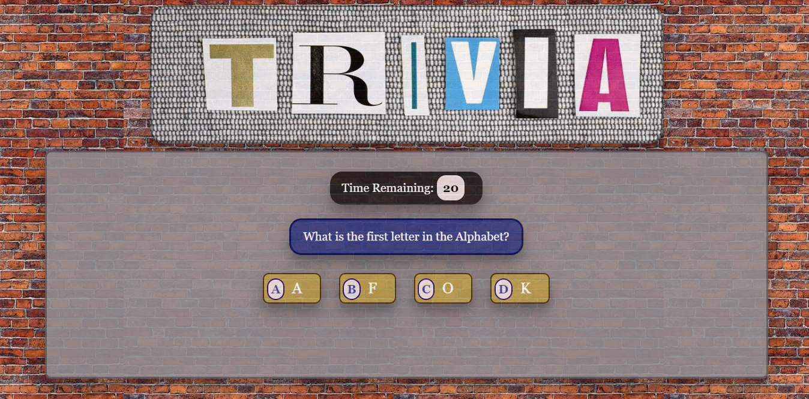
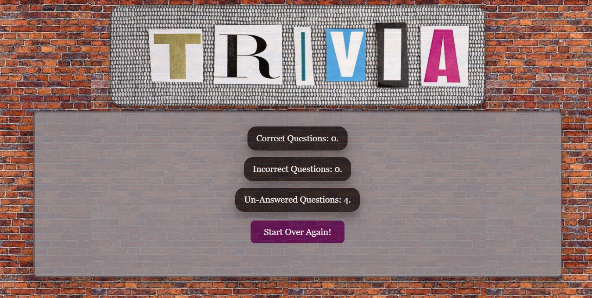

# Trivia Game

## Overview:
This application is a Trivia game, the game will ask a several general knowledge questions as every question has an answering time. At the end, the game will show the results.

## Project Dependencies:
This app requires to include this CDN library: `jquery`.

## Basic Usage:

* The app runs by opening the `index.html` in the web-browser, then the user can start the game by clicking on the `start` button and start answering the questions.

* If the question timeout has reached or the player selects a wrong answer, the game will highlight the right answer.

* At the end of the game, results are presented and `restar` button is presented to restart the game.

## Screenshot of Usage:
* Screenshot of the game:

  

* Screenshot of game results:

  

## Try it:

This [link](https://ibsafi.github.io/TriviaGame/) will jump you to test the application, have fun!